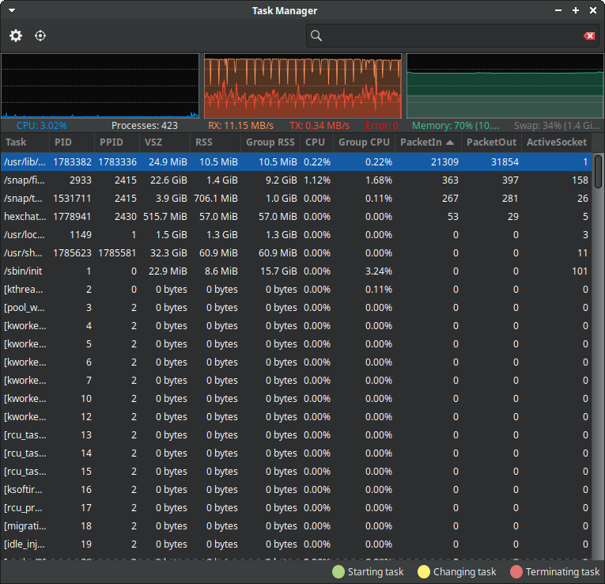

[](https://gitlab.xfce.org/apps/xfce4-taskmanager/-/blob/master/COPYING)

# xfce4-taskmanager

The xfce4-taskmanager component is an easy to use graphical task manager.

## New Features

### Network Graph

The app now includes a network graph that allows you to visualize the global system traffic (rx, tx and error) in real-time.

### PCAP Sniffing

PCAP functionality to sniff the network traffic for each port.
This is done via inode mapping, which also adds 3 new columns to the displayed process list:

- Number of incoming packets
- Number of outgoing packets 
- Number of used sockets by the application

### Screenshot
Here is a screenshot of the updated app:

Screenshot


## Required Capabilities

In order for the PCAP sniffing functionality to work, you need to set the following capabilities on the `xfce4-taskmanager` binary:

```
sudo setcap "cap_net_admin,cap_net_raw,cap_dac_read_search,cap_sys_ptrace+pe" ./src/xfce4-taskmanager
```

This grants the necessary permissions for the application to access network interfaces and system resources.

----

### Homepage

[Xfce4-taskmanager documentation](https://docs.xfce.org/apps/xfce4-taskmanager/start)

### Changelog

See [NEWS](https://gitlab.xfce.org/apps/xfce4-taskmanager/-/blob/master/NEWS) for details on changes and fixes made in the current release.

### Source Code Repository

[Xfce4-taskmanager source code](https://gitlab.xfce.org/apps/xfce4-taskmanager)

### Download a Release Tarball

[Xfce4-taskmanager archive](https://archive.xfce.org/src/apps/xfce4-taskmanager)
    or
[Xfce4-taskmanager tags](https://gitlab.xfce.org/apps/xfce4-taskmanager/-/tags)

### Installation

From source code repository: 

    % cd xfce4-taskmanager
    % ./autogen.sh
    % make
    % make install
	% sudo setcap "cap_net_admin,cap_net_raw,cap_dac_read_search,cap_sys_ptrace+pe" /usr/local/bin/xfce4-taskmanager

From release tarball:

    % tar xf xfce4-taskmanager-<version>.tar.bz2
    % cd xfce4-taskmanager-<version>
    % ./configure
    % make
    % make install
	% sudo setcap "cap_net_admin,cap_net_raw,cap_dac_read_search,cap_sys_ptrace+pe" /usr/local/bin/xfce4-taskmanager

### Reporting Bugs

Visit the [reporting bugs](https://docs.xfce.org/apps/xfce4-taskmanager/bugs) page to view currently open bug reports and instructions on reporting new bugs or submitting bugfixes